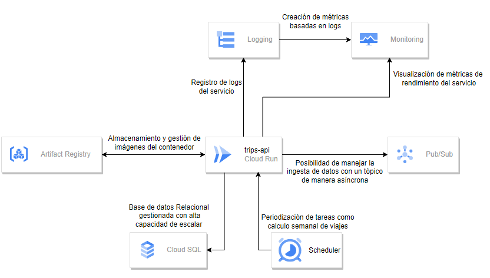

# Neural Works test

This project is a web application made with Python framework Flask, with the only purpose to do the Neural Works test.

The challenge itself has not been completed 100% percent but there is a lot of work here, and many endpoints with views have been implemented, take a look.

## Index

- [Requirements](#requirements)
- [Installing](#installing)
- [Usage](#usage)
- [Project structure](#project-structure)
- [Extra](#extra)

## Requirements

Before start, you need to install a Python version to run this project properly. 

- The project was made with Python at its versión 3.9.13.
- Download [Python](https://www.python.org/downloads/release/python-3913/).

## Installing

1. First you need to clone this repository.

```bash
git clone https://github.com/lorenspaez/neural-works-test.git
```
2.  Then its recomended to create a virtual enviroment at the outsider folder to run the project.
```bash
python -m venv venv
```
3. Activate the enviroment in the path.
```bash
venv/bin/activate
```
4. Once you enabled the virtual enviroment, run the following command to install all the dependencies.
```bash
pip install -r requirements.txt
```
5. Now it's necessary to initialize the database and migrate the Trip model, in this case we are using SQLite:

```bash
flask db init
flask db migrate -m "Trip table created"
flask db upgrade
```

## Usage

1. To run the server in your local, run the following flask command inside the /api/ folder:
```bash
flask run
```
2. If you want to run the project in debug mode use instead:
```bash
flask run --debug
```
3. Finally in your browser, search the following url to access the web application.
```bash
http://localhost:5000
```

## Project structure

Directory structure of the project:

    api/
        app.py: Python file that contains the source code of the Flask application.
        templates/: Contains HTML templates used by the application to serve the views.
        static/: Contains static files such as CSS.

## Proposed architecture



## Extra

Also in the repository, you will some useful and important files such as:

- python notebook file  `main.ipynb` which contains a Pandas workaround made to understand better the challenge and given dataset.

- dataset file `trips.csv` with testing data.

- Architecture diagram.

- Some Docker and Git settings.

For more details about the project, once running the server read some instructions at the main page at `http://localhost:5000/`